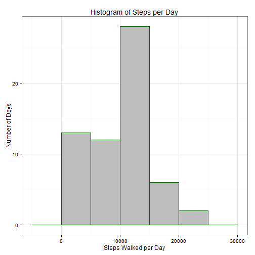
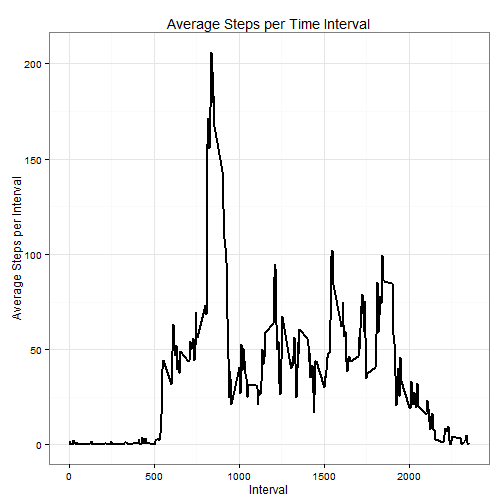
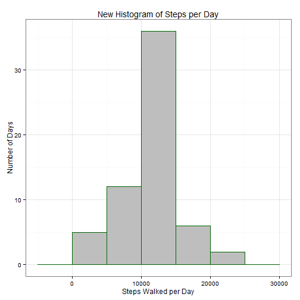
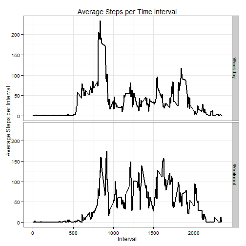

# Reproducible Research: Peer Assessment 1
========================================================

## Loading and preprocessing the data


```r
library(ggplot2)
library(dplyr)
```

```
## Warning: package 'dplyr' was built under R version 3.1.1
```

```
## 
## Attaching package: 'dplyr'
## 
## The following objects are masked from 'package:stats':
## 
##     filter, lag
## 
## The following objects are masked from 'package:base':
## 
##     intersect, setdiff, setequal, union
```

```r
setwd("~/GitHub/RepData_PeerAssessment1")
activity<-read.csv("activity.csv")
activity$date<-as.Date(activity$date,"%Y-%m-%d")
```


## What is mean total number of steps taken per day?
Below is a histogram of the number of steps taken per day.  As you can see, the median is slightly more than 10,000.

```r
days.sum<-activity %>%
      group_by(date) %>%
      summarise(total=sum(steps,na.rm=T))

ggplot(data=days.sum,aes(x=total),xlab="Hey")+geom_histogram(binwidth=5000,colour = "darkgreen",fill="gray")+theme_bw()+
      ylab("Number of Days")+xlab("Steps Walked per Day")+labs(title="Histogram of Steps per Day")
```

 

Below is the mean and median number of steps taken per day

```r
days.sum %>%
      summarise(mean=mean(total,na.rm=T),median=median(total, na.rm=T))
```

```
## Source: local data frame [1 x 2]
## 
##   mean median
## 1 9354  10395
```


## What is the average daily activity pattern?
Below is a graph displaying the average daily steps taken over the two months.

```r
interval<-activity%>%
      group_by(interval)%>%
      summarise(avg=mean(steps,na.rm=T))

ggplot(data=interval,aes(x=interval,y=avg))+geom_line(lwd=1)+theme_bw()+ylab("Average Steps per Interval")+xlab("Interval")+
      labs(title="Average Steps per Time Interval")
```

 


## Imputing missing values
The statment below counts the number of NAs or missing values in the data.

```r
sum(is.na(activity$steps))
```

```
## [1] 2304
```
Thus, there are 2,304 missing values in the data set.

The code below replaces all the NAs with the interval mean then creates a new histogram with the data.

```r
activity$ID<-paste(activity$date,activity$interval,sep=" - ")
nas<-activity[is.na(activity$steps),]
nas<-left_join(nas,interval,by="interval")

new.activity<-left_join(activity,select(nas,ID,avg),by="ID")
new.activity$steps<-ifelse(is.na(new.activity$steps),new.activity$avg,new.activity$steps)

new.days.sum<-new.activity %>%
      group_by(date) %>%
      summarise(total=sum(steps,na.rm=T))

ggplot(data=new.days.sum,aes(x=total),xlab="Hey")+geom_histogram(binwidth=5000,colour = "darkgreen",fill="gray")+theme_bw()+
      ylab("Number of Days")+xlab("Steps Walked per Day")+labs(title="New Histogram of Steps per Day")
```

 

Below is the new mean and median number of steps taken per day with the NAs replaced with the interval mean.

```r
new.days.sum %>%
      summarise(mean=mean(total,na.rm=T),median=median(total, na.rm=T))
```

```
## Source: local data frame [1 x 2]
## 
##    mean median
## 1 10766  10766
```
These values changed alot from the original values.  As you can see, the mean and median are now the same number.  By replacing the NAs with the interval mean, our data becomes closer to a normal distribution.


## Are there differences in activity patterns between weekdays and weekends?
Below is the code and graphs looking at the average steps per interval during the week and the weekend.

```r
activity$Day<-weekdays(activity$date)

activity$Day.Type <- ifelse(activity$Day == "Monday" | 
                                  activity$Day == "Tuesday" |
                                  activity$Day == "Wednesday" | 
                                  activity$Day == "Thursday" | 
                                  activity$Day == "Friday","Weekday","Weekend")

new.interval<-activity%>%
      group_by(interval,Day.Type)%>%
      summarise(avg=mean(steps,na.rm=T))

ggplot(data=new.interval,aes(x=interval,y=avg))+geom_line(lwd=1)+ylab("Average Steps per Interval")+xlab("Interval")+
      labs(title="Average Steps per Time Interval")+facet_grid(Day.Type ~.)+theme_bw()
```

 
